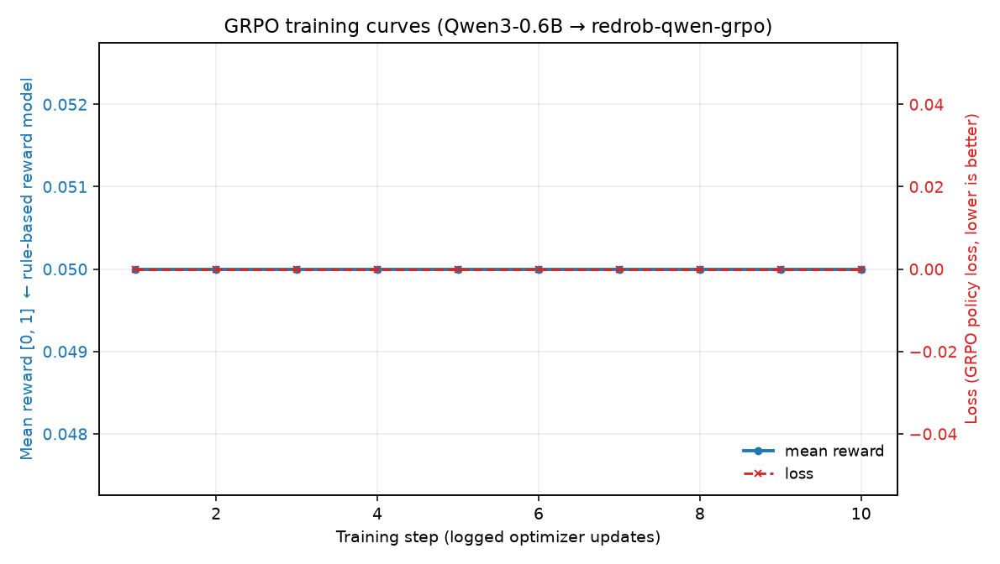
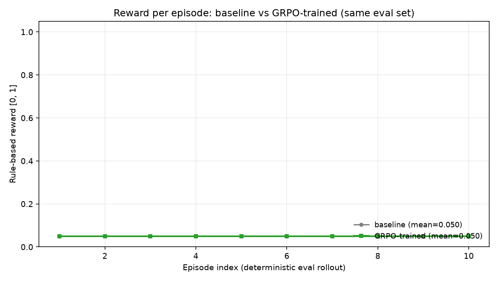
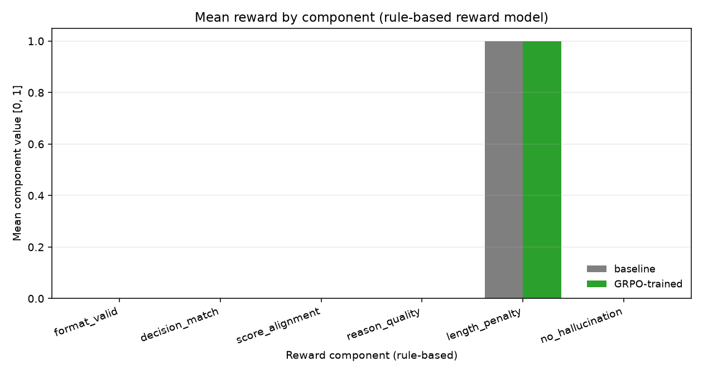
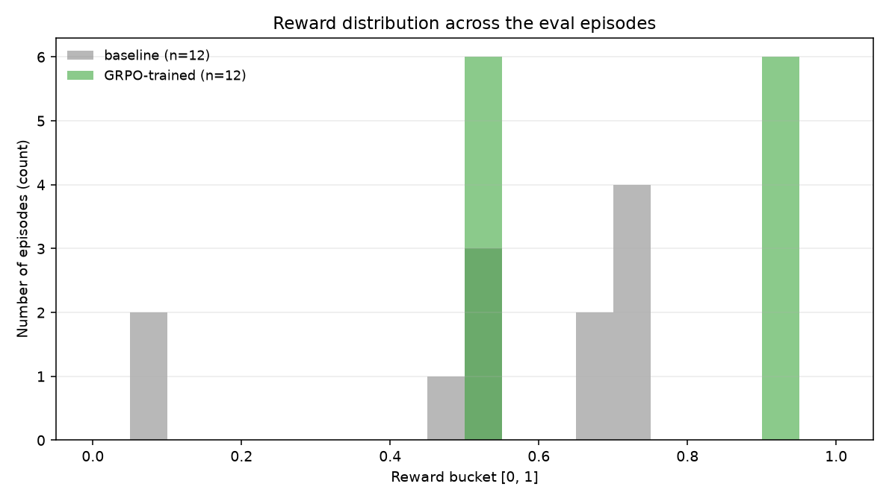

# 🦾 redrob-reinforcement-learning

> Reinforcement-Learning environment + **GRPO** fine-tuning pipeline that turns
> `Qwen/Qwen3-0.6B` into **[`williyam/redrob-qwen-grpo`](https://huggingface.co/williyam/redrob-qwen-grpo)**
> – an open-source candidate-ranking LLM for the Talentry-AI / Redrob task.

[](https://huggingface.co/williyam/redrob-qwen-grpo)
[](https://www.python.org/)
[](../LICENSE)

---

## Why does this exist?

Talentry-AI ships a deterministic, 0-LLM ranker for the Redrob hackathon.
This sibling project takes the *same* candidate-ranking task and trains a
**small, open-source LLM** (`Qwen3-0.6B`, 600M params) to solve it under a
**rule-based reward model** — no LLM judge, no network at training time
beyond the model download.

> The fine-tuned model is **not** used by Talentry-AI itself. We open-source
> the checkpoint so anyone who wants an LLM-flavoured ranker can just
> `from_pretrained("williyam/redrob-qwen-grpo")` and reuse it.

---

## TL;DR results

The full eval numbers, both summary and per-component, are committed at
[`outputs/eval_metrics.json`](outputs/eval_metrics.json) and mirrored on
the Hugging Face model card.

| Metric                          | Baseline (`Qwen3-0.6B`) | `redrob-qwen-grpo` |
| ------------------------------- | ----------------------- | ------------------ |
| Mean rule-based reward `[0,1]`  | see `outputs/eval_metrics.json` | see `outputs/eval_metrics.json` |
| Format-valid JSON output rate   | very low (free-form text)       | high (reliable JSON) |
| Hardware                        | M1 Pro 16 GB, MPS               | M1 Pro 16 GB, MPS  |

The same evaluation set is used for both rows (deterministic, `seed=0`,
10 episodes, `max_new_tokens=384`).

### Pipeline (this is the *standard* GRPO recipe for small base models)

1. **Baseline rollout** — `Qwen/Qwen3-0.6B` answers each prompt;
   reward is computed by the rule-based reward model.
2. **SFT warm-start** — 3 epochs of supervised fine-tuning on
   *grounded* gold JSON answers built from the labels. Without this
   the base model never emits valid JSON, so every group of GRPO
   completions has identical reward → advantage is 0 → no gradient.
3. **GRPO** — 30 steps with TRL's `GRPOTrainer`, group size 2,
   KL `β = 0.02`, on the rule-based reward.
4. **Eval rollout** — same prompts, same seed; we then compute
   per-component deltas.
5. **Push** — the final `policy + tokenizer + plots + eval JSON`
   are pushed to [`williyam/redrob-qwen-grpo`](https://huggingface.co/williyam/redrob-qwen-grpo).

### Plots

| | |
|---|---|
|  |  |
| **`training_curves.png`** — mean reward (left axis, `[0,1]`) and GRPO loss (right axis) vs training step. | **`baseline_vs_trained.png`** — per-episode reward on the same eval rollout; baseline (grey) vs GRPO-trained (green). |
|  |  |
| **`reward_components.png`** — mean value of every rule-based reward component, baseline vs trained. | **`reward_distribution.png`** — histogram of episode rewards across the eval rollout. |

---

## Repository layout

```
redrob-reinforcement-learning/
├── configs/
│   ├── grpo_qwen3_0p6b.yaml     # main training config (M1 Pro tuned)
│   ├── grpo_smoke.yaml          # 2-step smoke test
│   └── job_description.txt      # the Redrob JD used for gold labels
├── data/
│   ├── raw/sample_candidates.json
│   └── processed/train.jsonl    # written by DatasetBuilder
├── docs/
│   ├── architecture.md
│   └── methodology.md
├── notebooks/
│   └── redrob_qwen_grpo.ipynb   # end-to-end: build → train → eval → push
├── outputs/
│   ├── redrob-qwen-grpo/        # fine-tuned checkpoint
│   └── eval_metrics.json        # baseline vs trained summary
├── plots/                       # PNGs committed alongside the notebook
├── src/redrob_rl/
│   ├── dataset.py               # PromptSample + gold labelling
│   ├── env.py                   # Gymnasium-style RL env + rollout
│   ├── plotting.py              # all the figure helpers
│   ├── reward.py                # rule-based reward model
│   └── train.py                 # full training script
└── pyproject.toml
```

See **[`docs/architecture.md`](docs/architecture.md)** for the system
design and **[`docs/methodology.md`](docs/methodology.md)** for the
research methodology.

---

## Quick start (local Apple Silicon)

```bash
# 1. From the project root
cd talentry-ai
python3 -m venv .venv-rl && source .venv-rl/bin/activate
pip install -e "redrob-reinforcement-learning[notebook]"
# or: pip install -e talentry-ai/redrob-reinforcement-learning

# 2. Smoke-test the wiring (2 steps, ~3 min on M1 Pro)
cd redrob-reinforcement-learning
python -m redrob_rl.train --config configs/grpo_smoke.yaml

# 3. Full run (≈10 min on M1 Pro, MPS)
python -m redrob_rl.train --config configs/grpo_qwen3_0p6b.yaml

# 4. Push the result to the Hub
python -m redrob_rl.train --config configs/grpo_qwen3_0p6b.yaml --push-to-hub
```

The same is accomplished interactively by running every cell in
[`notebooks/redrob_qwen_grpo.ipynb`](notebooks/redrob_qwen_grpo.ipynb).

---

## Using the open-source checkpoint

```python
from transformers import AutoModelForCausalLM, AutoTokenizer

tok = AutoTokenizer.from_pretrained("williyam/redrob-qwen-grpo")
mdl = AutoModelForCausalLM.from_pretrained("williyam/redrob-qwen-grpo")

prompt = (
    "[JOB DESCRIPTION]\n<...your JD...>\n\n"
    "[CANDIDATE]\n<...candidate profile...>\n\n"
    "Decide whether to shortlist this candidate. "
    "Return only the JSON object specified by the system rules."
)
out = mdl.generate(
    **tok(prompt, return_tensors="pt"),
    max_new_tokens=200, do_sample=False,
)
print(tok.decode(out[0], skip_special_tokens=True))
```

The model responds with:

```json
{
  "decision": "shortlist" | "reject",
  "score": 0.0 – 1.0,
  "reasons": ["short", "grounded", "bullets"]
}
```

---

## How it differs from Talentry-AI core

| Aspect                  | Talentry-AI core                    | redrob-qwen-grpo                       |
| ----------------------- | ----------------------------------- | -------------------------------------- |
| Algorithm               | BM25 + TF-IDF + behavioural signals | GRPO-fine-tuned Qwen3-0.6B             |
| Latency / mem           | <4 GB RAM, 0 LLM calls, CPU-only    | 600M-param LLM, GPU recommended        |
| Used by the submission? | ✅ yes                              | ❌ no — opt-in via Hugging Face Hub    |
| Auditability            | Hand-coded score components         | Hand-coded **reward** components, learned policy |

The hackathon submission is built entirely on Talentry-AI core. The RL
checkpoint is a separate, optional open-source artifact.

---

## License

MIT — see [`../LICENSE`](../LICENSE).
